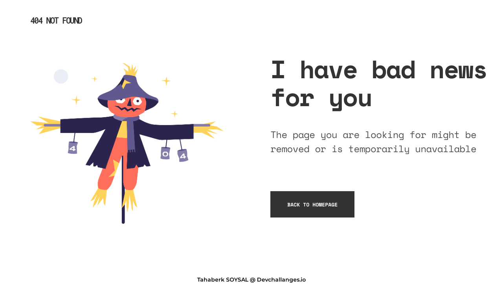

<!-- Please update value in the {}  -->

<h1 align="center">404 PAGE</h1>

   Solution for a challenge from  <a href="http://devchallenges.io" target="_blank">Devchallenges.io</a>.

  <h3>
    <a href="https://optimistic-visvesvaraya-1465b4.netlify.app/">
      Demo
    </a>
     | 
    <a href="https://github.com/berksysl/404-page">
      Solution
    </a>
     | 
    <a href="https://devchallenges.io/challenges/wBunSb7FPrIepJZAg0sY">
      Challenge
    </a>
  </h3>

## Overview

- Website [My 404 Page](https://optimistic-visvesvaraya-1465b4.netlify.app/)
- GitHub [berksysl](https://github.com/berksysl)
- Twitter [@berksysll](https://twitter.com/berksysll)
